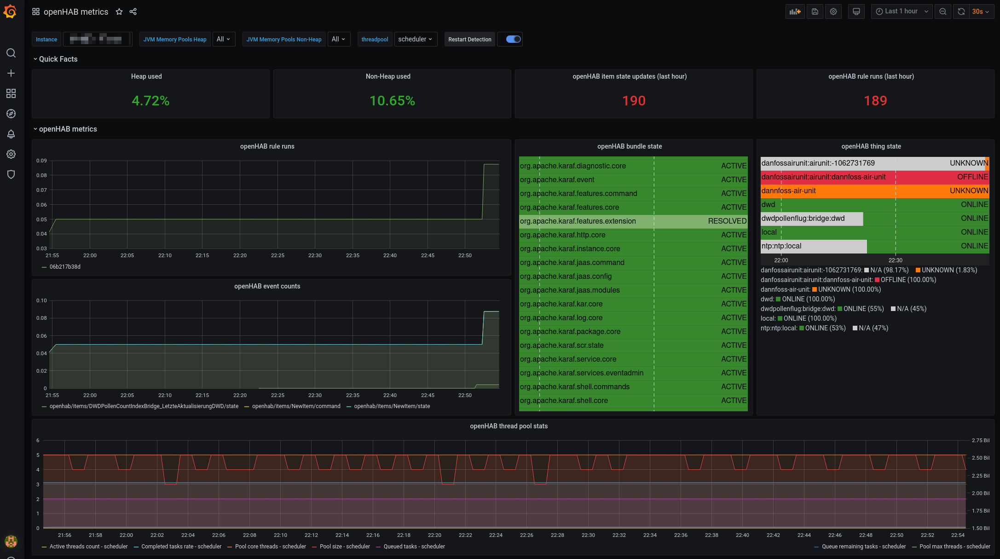
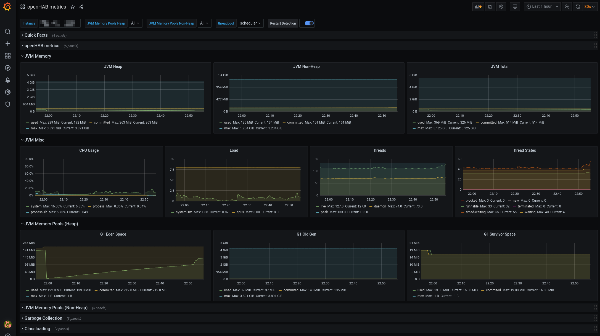
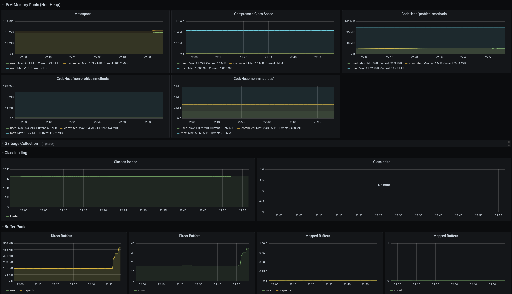

# Metrics service

The metrics service provides an additional REST endpoint to retrieve openHAB core metrics. This can be used as scrape target for e. g. [Prometheus](https://prometheus.io/).

## Provided metrics

Currently the following metrics are provided: 

- openHAB events counts (per topic)
- openHAB bundle states
- openHAB thing states
- openHAB rule runs (per rule)
- openHAB threadpool stats (per scheduler)
- JVM stats including metrics of
    - class loader
    - memory
    - GarbageCollector
    - OS (system load, CPU)
    - thread metrics

## Prometheus

For a start, the [Prometheus](https://prometheus.io/) format is supported. Once the IO addon is installed, the Prometheus endpoint will be available under:
_<openhab_host>:8080/metrics/prometheus_ 

Refer to the prometheus documentation on how to setup a Prometheus instance and add a scrape configuration. A typical scrape config could look like this (excerpt from `/etc/prometheus/prometheus.yml`):

````shell
scrape_configs:
  - job_name: 'openhab'
    scrape_interval: 1m
    scheme: http
    metrics_path: /metrics/prometheus
    static_configs:
    - targets:
      - 'openhab.local:8080'
````
Replace `openhab.local` by the openhab host.   

## Additional metric formats

The metrics service was implemented using [Micrometer](https://micrometer.io), which supports a number of [monitoring systems](https://micrometer.io/docs) 
It should be possible to add any of these, especially the ones using a pull mechanism ("scraping") like Prometheus does.     

## Grafana

You can now visualize the results in Grafana. Micrometer provides a public [Grafana dashboard here](https://grafana.com/grafana/dashboards/4701). 
I adapted it a little bit to include the openHAB metrics. You can download it here [Dashboard](docs/dashboard.json) 

Here are some screenshots: 



